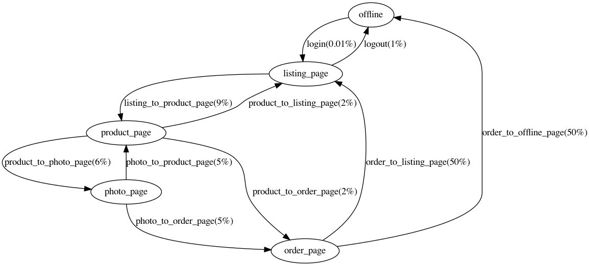
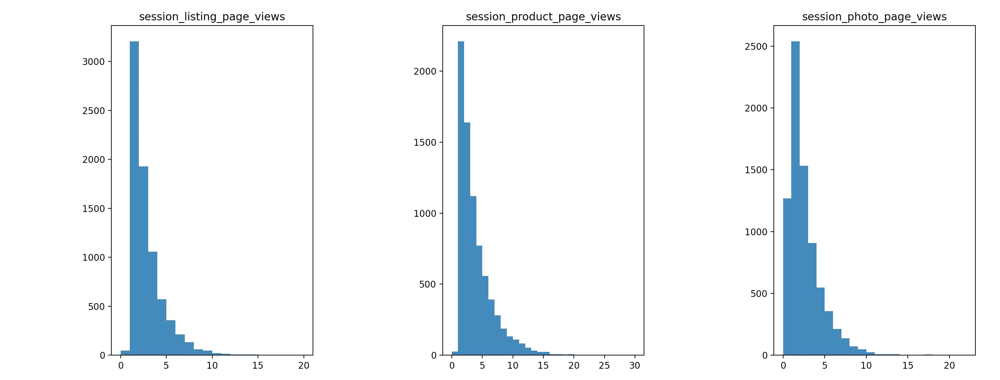

# Managing multiple data sources with Feast
### Kosma Grochowski

As effort in productionizing ML workflows is growing, feature stores are also growing in importance. Their job is to provide standardized and up-to-date features ready to use in production models, making it possible to reuse  existing features for different models, as well as to serve as data discovery platform - a database of feature metadata. On top of that, feature stores may provide limited feature engineering capabilities

Currently, [judging by the number of GitHub stars](https://github.com/topics/feature-store), the most popular open source feature store implementation is Feast. Combined Feast's and Amundsen's data discovery capabilities were already presented in [Mariusz's great blogpost](https://getindata.com/blog/machine-learning-features-discovery-feast-amundsen), while in this blogpost I will try to cover, how to use point-in-time join on data flowing from different sources, from relational database as well as from real-time data stream, in order to serve production-ready features.

# Demo

In order to showcase Feast's capabilites I created a demo containing a sample business case with two data sources, one of which is Postgres database, and the other is a Kafka topic. Its source code is available [right here on GitHub](https://github.com/getindata/feast-kafka-postgres-demo)

Let's assume a following business case - an e-commerce company offers products on their website. The company has access to data about users and their orders, which is stored in Postgres and a data stream regarding website traffic, which is ingested via Kafka topics.

The company wants to create features with the help of Feast in order to use them to get to know their consumers' behavior better. That is why, on top the data that defines the user in the Postgres table, it wants to engineer features based on web traffic data, such as the number of landing on the listing, product and photo pages.

Sample user behavior was modeled and corresponding data was generated using the invaluable [doge_datagen project](https://github.com/getindata/doge-datagen). This is the user behavior model's diagram:

The Feast is expecting a `feature_store.yaml` configuration file, and one or more Python files with Feast object definitions. The configuration I tested included using Postgres as an offline store and Redis as an online store.

Postgres and Kafka source support are a new thing in Feast coming at versions v0.21 and v0.22 respectively.
As of version 0.23, Kafka stream support is in experimental stage and I believe there is still room for improvement with regards to its interface. As stated in the [Feast docs](https://docs.feast.dev/reference/data-sources/kafka), Kafka sources must have a batch source specified, which can be used for retrieving historical features. Therefore, even if the Kafka stream is used only as online store source, a mock batch source must be created. So in the demo I ended up with three defined data sources:

- for orders, I created a batch Postgres source
- for traffic, I created a mock batch Postgres source, and an online Kafka source

Those sources identified their records using a subset of three defined entities: user, order and web traffic id. Finally, I defined two feature views, one for order details, and the other for user traffic, which I used to create a simple visualization. To showcase one step in visualizing the data, I created histograms showing expected number of visits on the listing, product and photo pages per one successful transaction. As you can see, all those histograms show similar distributions (which is expected, as this can be deduced from datagen model), and while most of the customers decide to buy the product after just a few clicks, some seem to ponder for a long time, before they finally click the shopping cart! 

# Caveats
While I was working on the demo, I encountered some issues which you may want to be aware of, if you are thinking about using Feast in your own project. Most of those issues can be linked to the still early stage of development, so be sure to check out [new Feast releases](https://github.com/feast-dev/feast/releases) regularly.

Feature extraction is still in the alpha stage and its capabilities are limited. For example, entity values are not provided in on demand feature views input dataframe, thus the dataframe is not suitable for aggregates extraction. Due to this limitation, I ended up transforming the Kafka source data before passing it on to Feast. Moreover, I did not find a way to take a random sample from offline/online store. Documentation says it is possible to provide pd.Dataframe or SQL. SQL solution seems more elegant, but I could not manage to successfully use this option.

What's more, as it stands, debugging is a pain, as during development internal libraries' exceptions galore.  When a `feast apply` command results in Pandas or psycopg2 exception, deducing what is the problem takes imagination and time. It also seems that Feast makes some assumptions about schemas that are not documented. For example, the defined source's event timestamp field and created timestamp field may not be the same field, as such a defined source will throw internal SQL generation exception. During my testing, Kafka online source has also silently failed to ingest records, without any exception, because of schema mismatch.

However, it seems that the Feast team is aware of the aforementioned debugging issue and [some fixes](https://github.com/feast-dev/feast/pull/2708) may be happening in the subsequent releases.

# Summary

Feature stores serve an important role in operationalizing machine learning models and Feast is certainly one of the most popular open source projects which is able to serve this role. The Feast framework still has some teething issues, which I summed up in previous chapter, however the rate of improvements is fast and I hope that as time goes on, the rough edges will be eliminated and the solution's productivity multiplier will be even greater. 
